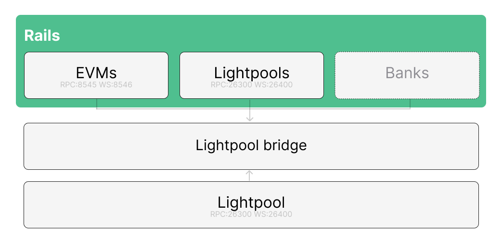

# lightpool-bridge

Off-chain bridge for **deposit and withdraw** between **EVMs**, **LightPools**, and **Banks** on one side and a **LightPool** node on the other. It watches those endpoints, collects committee signatures, and submits confirmations / unlocks. Ships EVM hub contracts under `contracts/` and an embedded Admin UI.

## Architecture



## Layout

- `src/` — Rust binary `lightpool-bridge` (router, EVM/LP WebSocket subscribers, Admin API)
- `admin/static/` — embedded Admin UI
- `contracts/` — Foundry EVM Bridge hub + deploy scripts
- `docs/LOCAL_E2E_BRIDGE_SETUP.md` — end-to-end local setup
- `docs/images/` — architecture diagrams
- `bridge.config.example.json` — config template

## Build

```bash
cd lightpool-bridge
cargo build --release
```

## Quick start

See [`docs/LOCAL_E2E_BRIDGE_SETUP.md`](docs/LOCAL_E2E_BRIDGE_SETUP.md).
